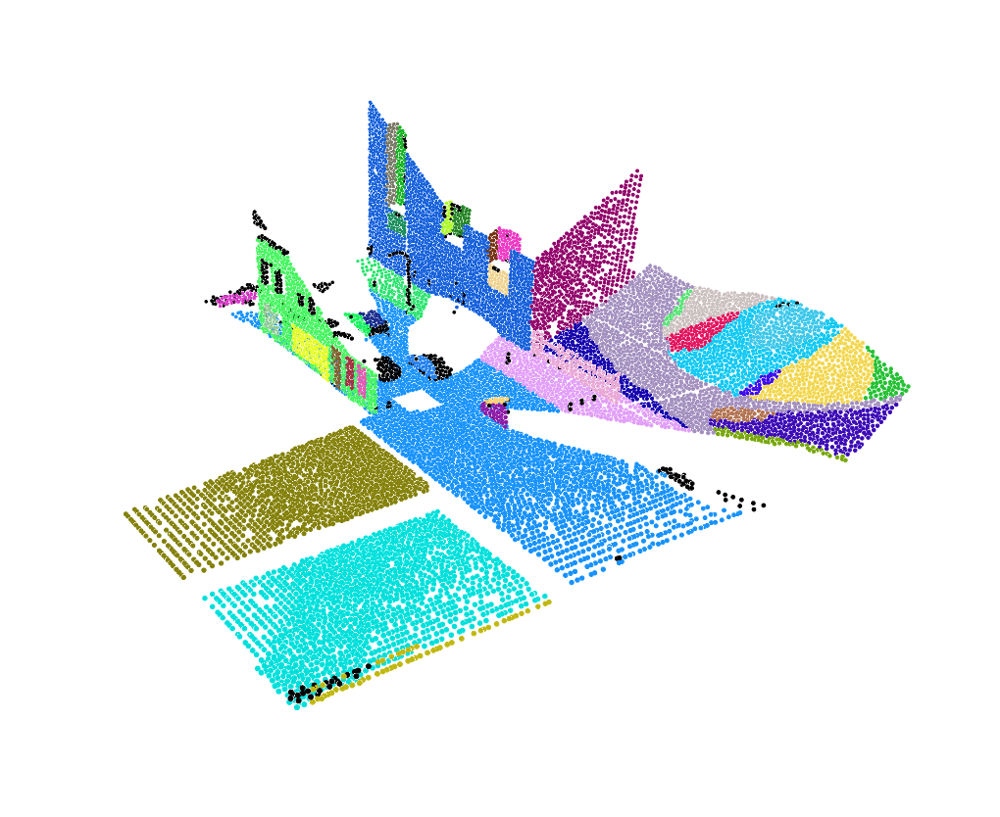

# PrimitiveFitting

## Example Preview

A primitive fitting example of Synthia 4D dataset, you can find the visualization file at`./Data/visual/example.xyzrgb`.



## Dependencies

Our region grow algorithm is implemented with [CGAL](https://www.cgal.org/) and [Eigen](http://eigen.tuxfamily.org).

Take Linux for example, you are recommened to install `CGAL` with a package manager, which will automatically check all essential third party dependencies with the correct versions and save you HUGE time. Try:

```shell
sudo apt-get install libcgal-dev
```

to install CGAL or you can download and compile it manually as well. 

`CGAL >= 5.1.0`  is recommended.

For more details, please go https://www.cgal.org/download.html

## Data Preparation & Run

We have prepared a demo data file under `./Data/Synthia4D`. You can run the program with one command:

```shell
sh example.sh
```

and the visualization file will be generated under  `./Data/visual` and primitive fitting output file under `./Data/output` as well.

### Data preparation

The input of region grow algorithm is required to be  `.ply` files. Considering the source data of Synthia 4D is `.npz`  files, we provide a preprocessing python program  `preProcess.py`  to conveniently transform formats.

For example, try the following command to generate `.ply` files: 

```shell
python preProcess.py --target ply --sourceDir SYNTHIA_SOURCE_DIR  --plyDir PLY_FILE_DIR
```

where `sourceDir` should be the directory of downloaded Synthia4D `.npz` files, and `plyDir` is the directory of the correct `.ply` files to be generated(which is also the input directory of primitive fitting algorithm).

### Compile & Run

Souce file of primitive fitting is at `./PlaneDetection3D/region_growing_3d.cpp`.

You can compile it and run the program with following commands

```shell
mkdir build
cd build
cmake .. -DCMAKE_BUILD_TYPE=Release
make -j8
cd ..
./bin/Release/region_growing_3d -i INPUT_PLYFILE_DIR -o OUTPUT_DIR -v VISUAL_DIR
```
where `INPUT_PLYFILE_DIR` is the input directory of `.ply` files and `OUTPUT_DIR` is the output directory. `VISUAL_DIR` controls the location of visualization files.

